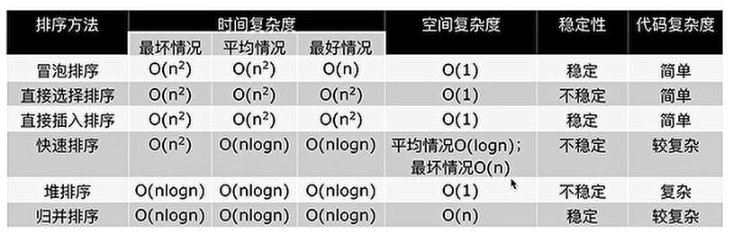
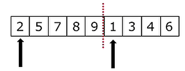

# Algorithm

一些算法练习 `Python`版

### 1.基本算法

1. ### 引述
    + [汉诺塔](base/hanoi.py)
    + [查找](base/search.py)
        + [顺序查找](base/search.py)
        + [二分查找](base/search.py)


### 2.排序

+ #### 简述
    + 排序：将一组”无序“的记录序列调整为“有序”的记录的序列

    + 列表排序：无序列表变为有序列表

    + ##### 低效排序
        1. [冒泡排序](base/bubble_sort.py)
        2. [选择排序](base/select_sort.py)
        3. [插入排序](base/insert_sort.py)

    + ##### 高效排序
        1. [快速排序](base/quick_sort.py)
        2. [堆排序](base/heap_sort.py)
            + [` topk`问题](base/heap_sort.py)
        3. [归并排序](base/merge_sort.py)
        + ##### 小结
            
            + 三种方法时间复杂度都是O(nlogn)
            + 一般情况下，就运行时间而言：
                
                + 快速排序 < 归并排序 < 堆排序
            + ###### 缺点：
                
                + 快速排序：极端情况下排序效率低（列表倒序情况下；可通过随机挑选中间位置的方式很大程度上避免）
                + 归并排序： 需要额外的内存开销
                + 堆排序：在快的排序算法中相对较慢
        
    + ##### 其它排序
        1. 希尔排序
        2. 计数排序
        3. 基数排序
        
    +  ##### 总结

        +  

        +  ##### 简述

            +  稳定性：数的相对顺序不发生变化为稳定，反之为不稳定

            +  例子，按`name`值排序

                +  原始值

                    +  ```python
                        [
                             {'name': 'a', 'age': 18},
                        	{'name': 'b', 'age': 20},
                        	{'name': 'a', 'age': 25}
                        ]
                        ```

                +  稳定排序，会保证`name`为`a`的字典的相对顺序不会变化

                    +  ```python
                        [
                             {'name': 'a', 'age': 18},
                             {'name': 'a', 'age': 25},
                        	{'name': 'b', 'age': 20}	
                        ]
                        ```

                +  不稳定排序，不能保证`name`为`a`的字典的相对顺序不会变化

                    +  ```python
                        [
                             {'name': 'a', 'age': 25},
                             {'name': 'a', 'age': 18},
                        	{'name': 'b', 'age': 20}
                        ]
                        ```

            +  ###### 如何判断是不是稳定排序

                + 排序时，依次交换的为稳定排序，否则为非稳定排序

+ #### 低效排序
    + ##### [冒泡排序](base/bubble_sort.py)
        + 概念：列表每两个相邻的数，如果前面(索引序号小)的比后面的大，则交换这两个数
        + 一趟排序完成后，则无序区减少一个数，有序区增加一个数
        + 时间复杂度: O(n<sup>2</sup>)

    + ##### [选择排序](base/select_sort.py)
        + 概念：每次将无序区中最大的值取出来，放到有序区的最右侧
        + 时间复杂度: O(n<sup>2</sup>)

    + ##### [插入排序](base/insert_sort.py)
        + 思想：从无序区取出一个值，与有序区的值按从右向左的顺序比较，插入合适的位置，其右边的值都向右移动
        + 时间复杂度: O(n<sup>2</sup>)

+ #### 高效排序
    + ##### [快速排序](base/quick_sort.py)
        + ##### 思想：
            + 取第一个元素`p`(任意一个元素，这里选了第一个)，使元素`p`归位
            + 列表被`p`分为两部分，左边都比`p`小，右边都比`p`大
            + 递归完成排序

        + ##### 时间复杂度：O(nlogn)
            + 每一层的时间复杂度为 O(n)，一共有 `logn`层，所以，时间复杂度为 O(nlogn)

        + ##### 快速排序的问题
            + 递归消耗内存
            + 编程语言的最大递归深度限制
                + 如`Python`
                + 解决：可通过设置增加递归深度，`sys.setrecursionlimit(100000)`
            + 最坏情况，倒序列表的时间复杂度为 O(n<sup>2</sup>)
                + 解决：将`p`随机取，极大降低最坏情况出现的概率

    + ##### [堆排序](base/heap_sort.py)
        + ##### 树
            + 一种数据结构，比如目录树
            + 一种可以递归定义的数据结构
            + 由`n`个节点组成的集合
                + 若`n = 0`，这是一棵空树
                + 若`n > 0`, 那存在`1`个节点作为树的根节点，其它节点可以分为`m`个集合, 每个集合本身又是一棵树

            + ###### 一些概念
                + 根节点(图中`A`为根节点)
                + 叶子节点：没有下级节点的节点
                + 树的深度（高度）：最深有几层
                + 节点的度，该节点有`n`个子节点则该节点的度就是`n`
                + 树的度，整个树中，节点度最大的度值（在图中，`A`节点的度为6，在树内部最大，该树的度就是`6`）
                + 子节点，如 `E`是`A`的子节点
                + 父节点，如 `A`是`E`的子节点
                + 子树
            + 

            + ##### 二叉树
                + 概念：度不超过`2`的树（每个节点最多分两个叉）
                + 每个节点最多有两个子节点
                    + 两个子节点被区分为左子节点和右子节点
                + 

            + ##### 满二叉树
                + 每一层的节点数都达到最大值
                + 

            + ##### 完全二叉树
                + 叶节点只能出现在最下层和次下层
                + 并且最下面一层的节点都集中在该层最左边的若干位置的二叉树
                + 
                + 非完全二叉树
                    + 

            + ##### 二叉树的储存方式
                + 链式存储方式（看后面数据结构部分）
                + 顺序存储方式，用列表存

            + ##### 计算节点
                + 父节点索引为`i`，计算子节点
                    + 左子节点索引：`2i + 1`
                    + 右子节点索引：`2i + 2`
                + 子节点索引为`n`，计算父节点索引
                    + 父节点：`(n - 1) // 2`
                + 

        + ##### 堆：一种数据结构，特殊的完全二叉树
            + 大根堆：一棵完全二叉树，满足任一节点都比其子节点大
            + 小根堆：一棵完全二叉树，满足任一节点都比其子节点小
            + 

            + ##### 堆的向下调整
                + 当根节点的左右自子树都是堆，但是根不满足时，可以通过一次向下的调整来将其变换成一个堆
                + 调整前
                + 调整后

            + ##### 堆排序过程
                1. 创建堆(农村包围城市)
                    + 从最后一个非叶节点开始，对其所在子树进行一次调整
                    + 然后对同级子树进行调整
                    + 然后上一级子树
                2. 得到堆顶元素，为最大元素
                3. 去掉堆顶，将堆最后一个元素放到堆顶，此时可通过一次调整重新使堆有序
                4. 堆顶元素为第二大元素
                5. 重复步骤`3`，直到堆变空

            + 时间复杂度：O(nlogn)
            + `Python`内置堆模块(`heapq`)的使用

        + ##### [` topk`问题](base/heap_sort.py)
            + 简述：现有`n`个数，设计算法得到前`k`大的数(`k < n`)
            + 解决思路
                + 排序后切片，时间复杂度O(nlogn)
                + 低效排序三人组，时间复杂度O(kn)
                    + 冒泡排序
                    + 选择排序
                    + 插入排序
                + 堆排序 ✔️
                    + 取列表前`k`个元素建立一个小根堆，堆顶就是目前第`k`大的数
                    + 依次向后遍历愿列表，对于列表中的元素
                        + 如果小于堆顶，则忽略该元素
                        + 如果大于堆顶，则将堆顶更换为该元素，并且对堆进行一次调整
                    + 时间复杂度，O(nlogk)

    + ##### [归并排序](base/merge_sort.py)
        + ###### 归并：将两段有序的的列表合成一个列表。称为一次归并
            
            + 
        + ###### 归并排序原理
            
            + 分解：将列表越分越小，直至分成一个元素
            + 终止条件：一个元素是有序的
            + 归并：将两个有序列表归并，列表越来越大
            + 
        + 时间复杂度，O(nlogn)
        + 空间复杂度，O(n)

### 3.参考资料

+ [清华计算机博士带你学习`Python`算法`+`数据结构](https://www.bilibili.com/video/BV1RT4y1K7ww?from=search&seid=11817845565902710787)
